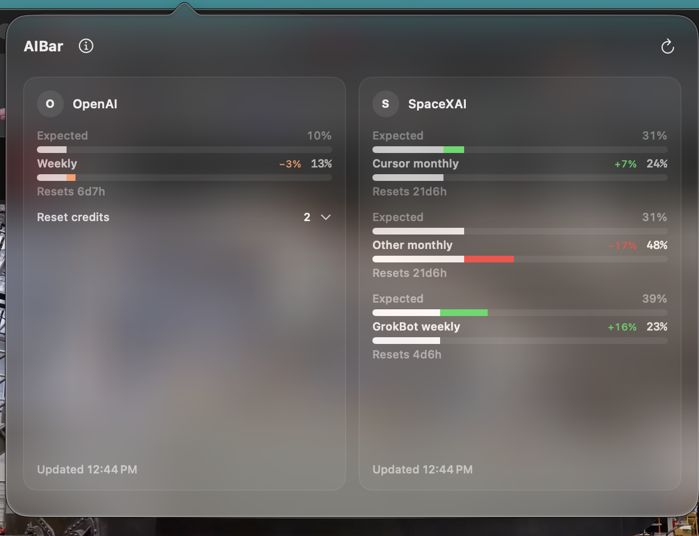
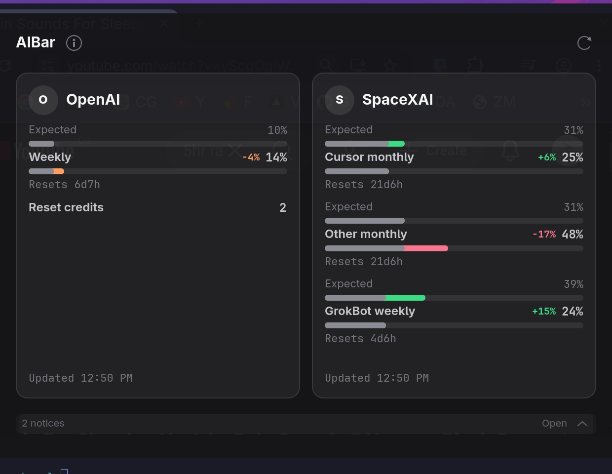

# AIBar

> [!IMPORTANT]
> **AIBar works on both macOS and Linux.** Run the same `./install.sh` command and it automatically installs the correct version for your operating system.

| Platform | What gets installed |
| --- | --- |
| **macOS** | Native SwiftUI menu-bar app at `/Applications/AIBar.app` |
| **Linux** | Shared engine and GTK dashboard under `~/.local/bin`, used by an Omarchy Quattro command widget |

Both versions show the same Codex, Claude, and SpaceXAI (Grok) subscription limits in matching three-card dashboards. One shared TypeScript engine owns authentication, quota fetching, pacing, reset countdowns, caching, and fallbacks; each platform keeps a thin native desktop adapter.

### macOS menu-bar app



The native macOS dropdown shows OpenAI (Codex), Anthropic (Claude), and SpaceXAI (Grok) simultaneously in three compact columns. Each column keeps its quota bars, reset countdowns, provider-specific details, and refresh time. The menu bar shows every provider's signed weekly pace at a glance.

## Features

- Matching Anthropic, OpenAI, and SpaceXAI dashboards on macOS and Linux, with full cards reserved for providers that have current or cached usage.
- Expected-first comparison meters on macOS and Linux keep shared usage neutral, color only the difference, and show a small signed delta. Reset countdowns cover session and weekly windows, while SpaceXAI also shows Cursor Models (Monthly), Other Models (Monthly), and GrokBot (Weekly).
- Signed weekly pace is `expected − actual`: negative means quota consumption is ahead of its linear allowance.
- Providers without current or cached usage leave the main card area and the macOS menu-bar and Omarchy compact counters. The slim notification control at the bottom of either dashboard includes their status and Login actions; **Clear notifications** hides the current set until its content changes.
- OpenAI reset-credit count in both dashboards, with each available credit's expiry shown by hovering over or clicking the macOS Reset credits row. Credits expiring within two weeks turn cosmic orange; credits expiring within one week turn red. Both thresholds also create a notification.
- Five-minute background refresh plus initial and manual refresh with a one-second minimum loading spinner on both dashboards, with caching and rate-limit backoff.
- Subtle per-provider last-updated time in both dashboards and the Linux tooltip.
- Native macOS launch-at-login control.
- Native macOS menu-bar summary with provider-letter warning colors tied to the percentage of each weekly limit already used.
- Automatic macOS/Linux installer routing.

## Display

The macOS menu bar shows all weekly pace values:

```text
A -1%  O +4%  S +39%
```

| Part | Meaning |
| --- | --- |
| `A` / `O` / `S` | Anthropic Claude / OpenAI Codex / SpaceXAI Grok |
| Signed percentage | Expected weekly consumption minus actual weekly consumption |
| Negative pace | Actual consumption is ahead of the linear allowance |
| Positive pace | Actual consumption is below the linear allowance |
| `--` | Weekly pace is unavailable for that provider |

Only the provider letter changes color based on the percentage of that provider's weekly limit already used: native label color below 75%, cosmic orange from 75% up to but not including 90%, and red at 90% or more. `S` uses the GrokBot Weekly limit, not either monthly Cursor bucket. The signed pace percentage keeps the native label color.

The macOS popover and Linux dashboard use the same fixed Anthropic, OpenAI, SpaceXAI order while giving full card width only to providers with current or cached usage. Expected appears above Actual for every comparable quota. Shared usage stays neutral, only remaining expected capacity is green, and only usage above expected is orange or red. A small signed `expected − actual` delta sits beside the actual value. A slim **Open** control at the bottom opens one notification center for unavailable quota lines, expiring reset credits, and provider access states. On macOS, click the OpenAI Reset credits row to expand each available credit and its expiry; hover shows the same list.

Linux retains its compact selectable bar display:

```text
O(1) → ◉1% ⧖1%
```

`◉` is quota consumed, `⧖` is elapsed window time, and the arrow expresses the existing relative pacing severity. Hover shows the compact tooltip; click opens the matching three-card dashboard. In the dashboard, only the pacing difference turns green, cosmic orange, or red; red begins when actual usage is at least 10 percentage points above expected.

Window lengths differ by provider. Codex reports its own window length. Claude's weekly window is seven days and resets on the account's assigned weekly schedule. SpaceXAI combines Cursor's monthly model buckets with Grok's weekly percentage and next reset time. See [docs/ARCHITECTURE.md](docs/ARCHITECTURE.md) for how each provider supplies this.

## Install

Clone the repository and run the same installer on either platform:

```sh
git clone https://github.com/andresreibel/AIBar.git
cd AIBar
./install.sh
```

The installer uses `uname`:

- macOS builds and installs `/Applications/AIBar.app`.
- Linux installs `~/.local/bin/aibar.ts`.

When upgrading an existing installation, the installer moves preserved credentials and notification state into `~/.codex/aibar`, clears stale render caches, updates the Omarchy widget, and removes the replaced app, commands, and shell helper.

On Linux, pass `--bashrc` to also install the short `aibar` shell command:

```sh
./install.sh --bashrc
```

### macOS

Requirements:

- macOS 14 or newer.
- Xcode Command Line Tools / Swift.
- Bun.
- `librsvg` for the app icon build.

```sh
xcode-select --install  # only when Swift is missing
brew install bun librsvg
./install.sh
open /Applications/AIBar.app
```

The app is currently built from source and ad-hoc signed. There is no notarized downloadable build yet.

### Linux

Requirements:

- Python 3, GTK 4, and PyGObject.
- `gtk4-layer-shell` is recommended on Wayland so the dashboard opens as a top-right popover; without it, AIBar uses a normal GTK window.



`./install.sh` installs the shared engine and `~/.local/bin/aibar-dashboard`. On Omarchy Quattro, add them as a command widget in `~/.config/omarchy/shell.json`:

```json
{
  "id": "aibar",
  "type": "command",
  "exec": "~/.bun/bin/bun ~/.local/bin/aibar.ts",
  "interval": 1,
  "onClick": "~/.local/bin/aibar-dashboard"
}
```

The one-second bar interval reads the local render cache; live usage requests remain limited to about once per five minutes. Hover for compact details and click to open or close the three-card dashboard. Initial load and every manual refresh hide the cards behind a spinner for at least one second, then reveal all provider data together. This uses Quattro's built-in command widget—no custom QML or plugin is required.

The dashboard command is always installed. The remaining commands use the optional `aibar` shell helper installed by `./install.sh --bashrc`:

```sh
aibar-dashboard
aibar
aibar --toggle
aibar --provider claude
aibar --provider codex
aibar --provider grok
aibar --login grok
```

## Authentication and state

AIBar keeps credentials outside the repository and application bundle. It reuses existing Codex and Claude CLI credentials and stores its own Grok sign-in:

- Codex: `~/.codex/auth.json`.
- Claude on Linux: `~/.claude/.credentials.json`.
- Claude on macOS: the credentials file when present, otherwise the `Claude Code-credentials` Keychain item.
- SpaceXAI: `~/.codex/aibar/grok-auth.json`, created with mode `0600` only after the explicit **Login** action.
- Linux provider selection and per-provider caches: `~/.codex/aibar/`.

The shared engine may refresh existing Codex or Claude OAuth credentials when required. SpaceXAI uses its own explicit PKCE sign-in and never opens a browser during normal refresh. Both dashboards use the same provider states: **Login required** shows a **Login** action, **Subscription expired** shows no false login action, **Usage unavailable** preserves ordinary refresh behavior, and temporary Claude fallback is labelled as cached usage. Available and cached providers receive the full dashboard area. Other states appear only in the slim bottom notification center and are omitted from the macOS menu-bar and Omarchy counters. **Clear notifications** hides the current provider, quota, and expiring-credit notices until their content changes. Anthropic login state uses the documented `claude auth status` exit contract; the undocumented usage endpoint and observed `subscriptionType` field are not treated as subscription-entitlement signals. Bare `401`/`402`/`403`, network, rate-limit, and malformed-response failures are never called subscription expiry. See [troubleshooting](docs/TROUBLESHOOTING.md).

## Development

```sh
make test
make app
make install
open /Applications/AIBar.app
```

Verification covers Swift payload decoding, macOS presentation, Keychain decoding, TypeScript compilation, packaging, and the installed bundle.

See [architecture](docs/ARCHITECTURE.md), [troubleshooting](docs/TROUBLESHOOTING.md), and the [changelog](CHANGELOG.md).

## Current verification

- macOS native app: built, installed, signed, launched, and live Codex usage verified.
- Codex free reset credits: verified against `rate_limit_reset_credits.available_count`.
- Claude macOS Keychain discovery: verified.
- SpaceXAI login and live Cursor-backed Grok weekly usage: verified in the installed macOS app.
- Claude live usage: account-dependent; the current OAuth endpoint can reject organization-managed accounts.
- Linux: the Quattro command widget and GTK dashboard use the shared engine.

## License

See [LICENSE](LICENSE).
