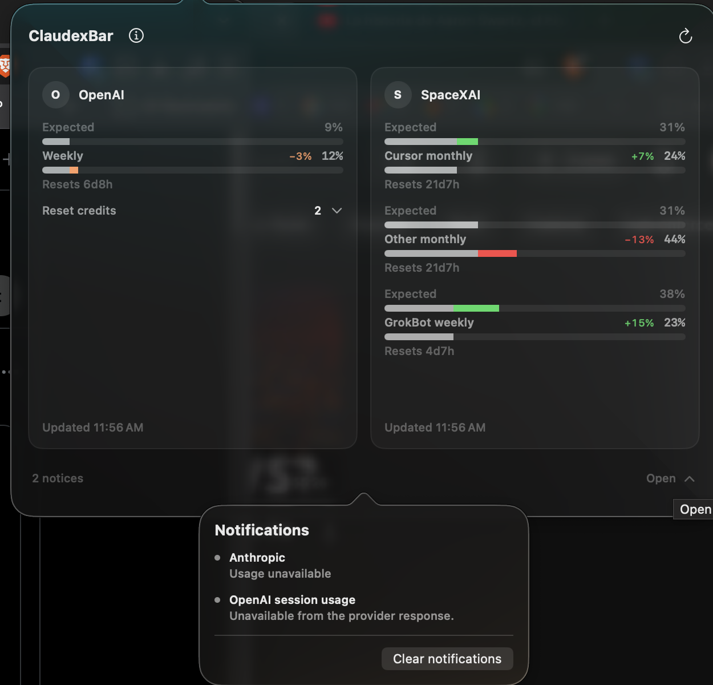

# Architecture

ClaudexBar is one product with a shared provider engine and thin platform adapters.

## Shared engine

`claudexbar.ts` owns:

- Codex and Claude credential loading, plus SpaceXAI PKCE sign-in and private credential storage.
- Provider usage requests and Codex RPC fallback.
- Session and weekly quota parsing.
- Pacing, warning state, reset countdowns, and reset-credit formatting.
- Claude caching and rate-limit backoff.
- Provider selection under `~/.codex/claudexbar/`.

It emits a JSON payload consumed by the Quattro command widget:

```json
{
  "text": "O(1) ↑ ◉78% ⧖60%",
  "tooltip": "Session 2% · reset 4h55m\nWeek 78% · warning · reset 2d9h\nUpdated: 07:34 PM",
  "class": ["warning", "provider-codex"],
  "percentage": 2,
  "percentageLabel": "Session",
  "resetCredits": 1,
  "resetCreditDetails": [
    {"title": "Full reset", "expiresAt": 1789949340},
    {"title": "Full reset", "expiresAt": 1791069960}
  ],
  "usageRows": [
    {"label": "Session", "percentage": 2, "resetText": "4h55m", "severity": "normal", "pacing": {"expectedPercentage": 1}},
    {"label": "Weekly", "percentage": 78, "resetText": "2d9h", "severity": "warning", "pacing": {"expectedPercentage": 60}}
  ]
}
```

`percentage` and `percentageLabel` retain the compact cross-platform compatibility field. `usageRows` is the ordered native detail contract: the shared engine owns labels, actual percentages, expected percentages, reset countdowns, and per-row severity. Both Swift and GTK render expected-first comparison meters that keep common usage neutral and color only the difference. Expected usage is the rounded share of the real quota window that has elapsed; monthly Cursor rows use the returned billing-cycle start and end rather than a calendar approximation. The shared tooltip omits normal pacing prose and appends `warning` or `critical` only to the quota window that triggered that severity.

`resetCredits` remains the authoritative available count from the OpenAI usage response. After a successful OAuth usage read, the engine asks the supported local Codex app-server `account/rateLimits/read` method for optional `resetCreditDetails`. Each emitted detail contains only the backend display title and optional Unix-seconds expiry; account, credit, grant, and description fields are never retained. The macOS Reset credits row exposes the localized title and expiry list on hover and click. Both adapters color the count cosmic orange within 14 days of the earliest expiry and red within 7 days, and add each qualifying credit to the bottom notification center. Older/count-only Codex versions and failed enrichment return an empty list without hiding the count or failing quota refresh.

The macOS app invokes `claudexbar.ts --all`. That additive response wraps one unchanged payload per provider in fixed Anthropic, OpenAI, SpaceXAI order and includes `weeklyPace`, calculated as expected weekly percentage minus actual weekly percentage. Each provider reads or refreshes its own existing cache independently. The normal no-argument engine output and persisted provider selection remain unchanged for Linux.

## Quota windows

Pacing needs a window length, because `⧖` reports how much of the window has elapsed. The three providers supply it differently:

- Codex returns `limit_window_seconds` per window, so the engine uses the reported length.
- Claude's `/api/oauth/usage` returns only `utilization` and `resets_at`, so the engine holds the lengths as constants: `CLAUDE_SESSION_WINDOW_MS` (5 hours) and `CLAUDE_WEEKLY_WINDOW_MS` (7 days).
- SpaceXAI's Cursor-backed `GetCurrentPeriodUsage` Connect endpoint supplies the Cursor Models (Monthly) and Other Models (Monthly) percentages and billing-cycle reset. `GetSandUsageStatus` supplies GrokBot (Weekly) usage and its next reset; the engine uses a seven-day pacing window for that row.

Claude's weekly field is named `seven_day` and resets on a fixed account schedule. The reset day and time do not change when a subscription begins, so pacing must use the full seven-day cycle even when the implied start predates a recent signup or upgrade.

## Severity policy

The shared engine derives severity independently for every quota row. Actual usage at or below expected is normal; usage above expected but less than 10% over pace is warning; usage at least 10% over pace is critical. The platform adapters map warning to cosmic orange (`#ff9e64`) and critical to red.

Reset-credit urgency is presentation-only and time-based: no color outside 14 days, cosmic orange at 14 days or less, and red at 7 days or less. It does not alter quota severity or compact output.

## Linux adapter

Linux installs the shared engine into `~/.local/bin/claudexbar.ts` and the thin GTK 4 adapter into `~/.local/bin/claudexbar-dashboard`. Omarchy Quattro runs the engine as its built-in command widget on a short interval and reads its five-minute render cache. Its compact plain-text tooltip holds the selected provider's session, weekly, reset, and refresh details.

Clicking the bar launches the GTK dashboard. It invokes `claudexbar.ts --all`, decodes the same fixed provider order and payload fields as macOS, and renders full cards only for providers with current or cached usage. The adapter owns presentation of the slim notification center but does not duplicate authentication, quota, pacing, severity, or cache classification. On Wayland, optional `gtk4-layer-shell` anchors the dashboard as a top-right overlay; otherwise GTK presents a normal window. A second launch closes the existing dashboard instance.

## macOS adapter



The Swift package contains:

- `ClaudexBarCore`: single-provider and aggregate payload decoding, provider metadata, signed pace formatting, severity mapping, reset-credit expiry urgency, and macOS-only presentation cleanup.
- `claudexbar-macos`: native SwiftUI content hosted in an `NSPopover`, a variable-width `NSStatusItem`, refresh scheduling, SpaceXAI sign-in, and shared-engine process execution.

The packaged app bundles `claudexbar.ts` under `Contents/Resources`. The Swift app locates Bun, invokes `--all` off the main actor, decodes the aggregate payload, and renders all providers. Provider logic is not duplicated in Swift.

The menu bar displays signed weekly pace for eligible Anthropic, OpenAI, and SpaceXAI accounts. The macOS popover and Linux dashboard give the full card area only to providers with current or cached usage; provider selection remains a Linux-only interaction. Comparable rows place Expected above Actual, show a compact signed `expected − actual` delta, and color only the non-overlapping meter segment green, orange, or red. Both dashboards collect unavailable quota lines, qualifying reset-credit expiries, and provider access states into one slim notification control at the bottom instead of placing persistent warnings inside usage cards.

Every normalized provider payload has one engine-owned `accessState`: `available`, `stale`, `unavailable`, `login_required`, or `subscription_expired`. Both adapters render the same label and action table and never inspect credentials or parse provider errors. **Login required** is the only state with a **Login** action. Only available or cached-stale providers receive full dashboard cards and compact counters. Other states remain in `--all` and appear in the bottom notification center. Clearing notifications persists a deterministic signature covering the current provider states, unavailable quotas, credit expiries, and urgency; any content change invalidates the dismissal. Old render caches without a valid state are rejected. For Anthropic, a documented `claude auth status` exit code of `1`, missing Claude.ai OAuth credentials, or OAuth refresh `invalid_grant` means login is required. The undocumented OAuth usage endpoint's `401`/`402`/`403`, `429`, network, malformed-response, and generic failures remain unavailable. The observed `subscriptionType` JSON field is not a documented current-entitlement contract and is not used. `subscription_expired` is reserved for a future documented entitlement signal and is not inferred from status codes or prose.

## Credentials

- Codex uses `~/.codex/auth.json`.
- Claude uses `~/.claude/.credentials.json` when available.
- On macOS, Claude falls back to the `Claude Code-credentials` Keychain item.
- SpaceXAI uses ClaudexBar-owned `~/.codex/claudexbar/grok-auth.json`, written atomically with mode `0600` after an explicit PKCE sign-in. The browser opens only for that user action; normal refreshes never initiate login. Grok usage requests have a 10-second timeout, and missing or rejected credentials require explicit reconnection.

Credential values must never appear in tests, logs, screenshots, documentation, or Git history.

## Build and install

`Makefile` builds the Swift release executable, generates the icon, creates the `.app` bundle, embeds the shared engine, and ad-hoc signs the bundle. `install.sh` selects this path on Darwin and installs the shared Linux engine and GTK dashboard for Quattro.
